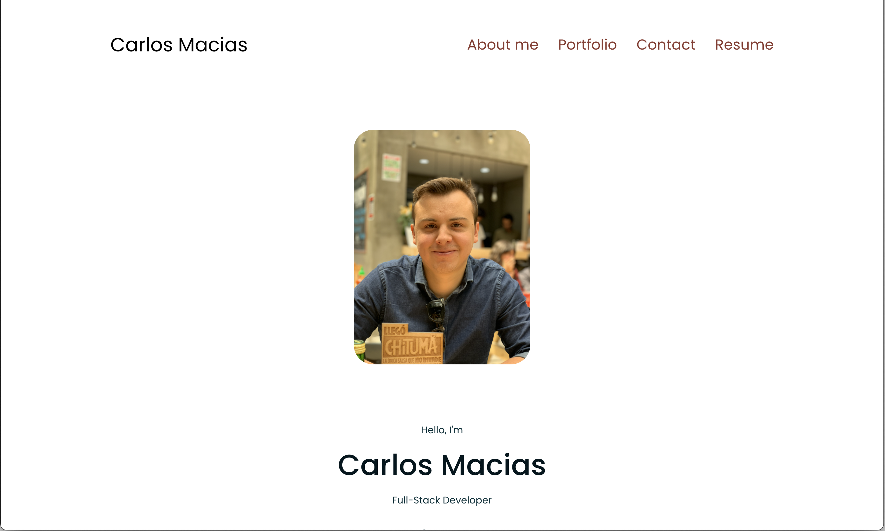

# React Portfolio

## Description
 This repo contains the Module 20 Challenge. This project is a personal portfolio for a web developer, designed as a single-page application (SPA) using React. It showcases the developer's skills, projects, and professional details in a sleek, interactive, and user-friendly interface.

 ## Table of Contents

* [Installation](#installation)
* [Usage](#usage)
* [Contributing](#contribution)
* [Credits](#credits)
* [Features](#features)
* [Test](#tests)
* [License](#license)
* [Questions](#questions)

## Installation

N/A

## Usage

You can visit the deployed portfolio at: [Portfolio](https://main--ubiquitous-faloodeh-26759b.netlify.app/)

## Credits

The development of this portfolio application was supported by various resources and tools. Special thanks to the following:

Poppins Font from npmjs:
- https://www.npmjs.com/package/@fontsource/poppins
 This npm package provided the Poppins font used throughout the application.

Color Schemes from My Color Space:
- https://mycolor.space/?hex=%2302333C&sub=1
 This tool assisted in choosing the color scheme for the application.

React's useState Hook:
- https://react.dev/reference/react/useState
 Provided detailed information on the useState hook used for state management in React.

React Router for SPA Routing:
- https://reactrouter.com/en/main/start/tutorial#the-root-route
 Guided the implementation of routing in the single-page application.

React Icons for UI Enhancement:
- https://react-icons.github.io/react-icons/
 Offered a variety of icons used to enhance the user interface.

## Contribution

Contributions, problems, and suggestions for features are encouraged!

## Tests
N/A

## License

This project is licensed under the MIT license.

For more information see [this link](https://opensource.org/licenses/MIT).

## Questions

- **GitHub**: Please visit my GitHub profile:
[carlos-2mm](https://github.com/carlos-2mm)
- **Email**: For clarifications or questions about this project, please send an email to:
 cimm21187@gmail.com

